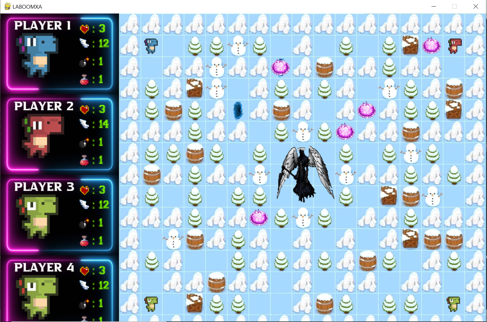

# LABOOOMXA
This is the LABOOOMXA game created by my group

## Members
* Tran Tuan Viet - HCMUS - 21APCS
* Bui Nguyen Hoang - HCMUS - 21APCS
* Hoang Nghia Viet - HCMUS - 21APCS

## Description
The game is coded in Python 3 using the graphic library [Pygame](https://www.pygame.org/wiki/tutorials).

## Getting Started
### Installing
* Clone the project to your computer. 
```
  git clone https://github.com/hoangteo0103/LABOOOMXA.git
```
* Set up Pygame Library.
```
  pip install pygame
```

### Executing program
* Using an IDE to compile this game (Sublime Text 3, Pycharm, Visual Studio Code, ...)
* Remember to add all source codes to project before building and running

## Usage
* Game Menu Screen
<div align = "center">
  
</div>

* Select Character Screen
<div align = "center">
  
</div>

* Select Map Screen
<div align = "center">
  
</div>

* Game Screen
<div align = "center">
  
</div>

## Contact
Tran Tuan Viet - ttviet2805@gmail.com
